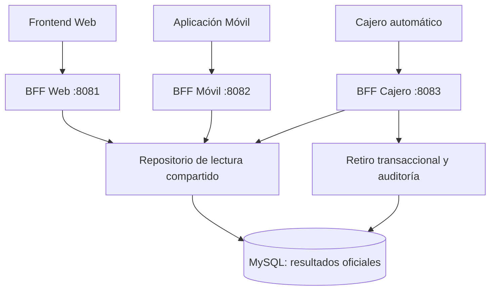

# Banco XYZ: Backend for Frontend y procesos batch

Proyecto académico de Desarrollo Backend III desarrollado con Java 17, Spring Boot 4.1.0, Spring Batch, Spring MVC, Spring Security, Spring JDBC y MySQL 8.

La solución conserva los tres procesos batch de las semanas anteriores y agrega una arquitectura **Backend for Frontend (BFF)** para tres clientes con necesidades diferentes: Web, aplicación móvil y cajero automático.

## Objetivo de la Semana 4

Aplicar el patrón BFF para evitar que todos los clientes consuman una API genérica. Cada canal dispone de un backend activable y desplegable de manera independiente, una ruta propia, una credencial propia, autorización por rol y DTOs adaptados a su interfaz.

La implementación responde a los cuatro criterios de evaluación:

1. Demuestra una comprensión clara del patrón BFF.
2. Implementa una estrategia de BFF.
3. Personaliza la información según las necesidades de cada frontend.
4. Organiza el código de acuerdo con la estrategia elegida.

La trazabilidad detallada entre pauta, código y evidencia se encuentra en `docs/Checklist_Pauta_Semana4.md`.

## ¿Qué es BFF y qué estrategia se eligió?

Backend for Frontend crea una capa de backend específica para cada tipo de interfaz. El BFF conoce las necesidades del cliente, consulta los datos compartidos y entrega una respuesta ya adaptada. Esto reduce datos innecesarios, evita lógica de composición en el frontend y permite aplicar seguridad particular por canal.

Se eligió una estrategia de **un BFF por canal dentro de un mismo código fuente, con despliegues independientes mediante perfiles de Spring**:

- Perfil `web`: BFF Web en el puerto 8081.
- Perfil `movil`: BFF Móvil en el puerto 8082.
- Perfil `cajero`: BFF Cajero en el puerto 8083.

Cada ejecución activa solamente los controladores y servicios de su canal. Los tres BFF reutilizan una capa de acceso a MySQL, pero no comparten sus contratos HTTP ni sus DTOs.

Las configuraciones de Jobs, Steps y pool batch se excluyen cuando cualquiera de esos perfiles BFF está activo. Por tanto, un servidor HTTP no crea lectores ni trabajadores batch que no necesita.



### Ventajas y decisión arquitectónica

- Cada frontend recibe solamente los campos que necesita.
- Cada canal puede ejecutarse, protegerse y escalarse de forma independiente.
- Un cambio del contrato móvil no obliga a modificar el contrato Web o Cajero.
- La lógica bancaria y el acceso a datos comunes no se duplican.
- La separación mediante paquetes y perfiles mantiene una solución académica fácil de ejecutar sin convertir el proyecto en tres repositorios distintos.

La principal compensación es que existen tres aplicaciones en ejecución y contratos separados que deben mantenerse. En este proyecto esa complejidad es intencional porque demuestra el aislamiento requerido por el patrón.

## Personalización por frontend

| Canal | Necesidad | Respuesta diseñada | Información omitida |
|---|---|---|---|
| Web | Vista completa y compleja | Titular, producto, saldo, último interés, estado anual, hasta 20 movimientos, descripciones, fuentes y resumen operacional | No se omite información relevante para la vista administrativa |
| Móvil | Respuesta ligera | Datos esenciales de la cuenta y endpoint separado con máximo 10 movimientos | Edad, interés, estado anual, descripción y archivo de origen |
| Cajero | Operaciones críticas y seguras | Cuenta enmascarada, saldo, disponibilidad de retiro y retiro transaccional auditado | Nombre, edad, historial, fuentes y demás información personal |

La diferencia no consiste solo en cambiar la URL: cada canal tiene DTOs y servicios propios. Esto se comprueba en Postman observando que la misma cuenta produce estructuras JSON diferentes.

## Seguridad por canal

Cada BFF exige el header `X-BFF-API-Key` y su propia variable de entorno:

| Perfil | Variable | Rol autorizado | Rutas permitidas |
|---|---|---|---|
| `web` | `BFF_WEB_API_KEY` | `ROLE_WEB` | `/api/bff/web/**` |
| `movil` | `BFF_MOVIL_API_KEY` | `ROLE_MOVIL` | `/api/bff/movil/**` |
| `cajero` | `BFF_CAJERO_API_KEY` | `ROLE_CAJERO` | `/api/bff/cajero/**` |

La API es stateless, no crea sesiones y rechaza una clave ausente o incorrecta con HTTP 401. Una credencial válida que intenta acceder a la ruta de otro canal recibe HTTP 403. Las claves no se guardan en Git: son obligatorias al iniciar cada perfil.

El retiro del cajero utiliza una transacción y bloquea la cuenta con `SELECT ... FOR UPDATE`. La actualización del saldo y la escritura en `operaciones_cajero` se confirman juntas; si una falla, ambas se revierten.

## Organización del código

```text
src/main/java/cl/duoc/bank_batch
├── bff
│   ├── web
│   │   ├── controlador
│   │   ├── dto
│   │   └── servicio
│   ├── movil
│   │   ├── controlador
│   │   ├── dto
│   │   └── servicio
│   ├── cajero
│   │   ├── controlador
│   │   ├── dto
│   │   └── servicio
│   └── compartido
│       ├── configuracion
│       ├── excepcion
│       ├── modelo
│       └── repositorio
├── configuration
├── listener
├── modelo
├── politica
├── procesador
└── servicio
```

Los paquetes `web`, `movil` y `cajero` representan los límites de cada BFF. `compartido` contiene únicamente infraestructura transversal. Los paquetes batch existentes siguen siendo responsables de cargar y transformar los archivos oficiales.

## Endpoints

| BFF | Método y endpoint | Propósito |
|---|---|---|
| Web | `GET /api/bff/web/cuentas/{cuentaId}` | Vista completa de una cuenta |
| Web | `GET /api/bff/web/resumen` | Resumen operacional para interfaz compleja |
| Móvil | `GET /api/bff/movil/cuentas/{cuentaId}` | Inicio liviano de la cuenta |
| Móvil | `GET /api/bff/movil/cuentas/{cuentaId}/movimientos?limite=5` | Movimientos resumidos; límite entre 1 y 10 |
| Cajero | `GET /api/bff/cajero/cuentas/{cuentaId}/saldo` | Saldo con cuenta enmascarada |
| Cajero | `POST /api/bff/cajero/cuentas/{cuentaId}/retiros` | Retiro múltiplo de 1.000, transaccional y auditado |

Ejemplo del cuerpo de retiro:

```json
{
  "monto": 2000
}
```

## Datos oficiales: verificación obligatoria

Los archivos incluidos en `src/main/resources/data/semana_3` se compararon byte por byte con `bank_legacy_data-main/data/semana_3` del ZIP oficial entregado para la actividad. Cada uno contiene 1.000 registros más su encabezado.

| Archivo predeterminado | Registros | SHA-256 oficial |
|---|---:|---|
| `data/semana_3/cuentas_anuales.csv` | 1.000 | `0690d81fe446affe39857a448ff5590c4f6e6f998150c08934db3aa41683e328` |
| `data/semana_3/intereses.csv` | 1.000 | `69cc39f468db47e4d752657db95ee9caf00ebcaf31581e45e104c4dc4a5e3120` |
| `data/semana_3/transacciones.csv` | 1.000 | `9a209c71d5556380481731f0fe9ac148a586a7c91698b377481b62e96341e836` |

Antes de generar evidencia se debe ejecutar desde la raíz del proyecto:

```powershell
powershell -ExecutionPolicy Bypass -File .\scripts\verificar-datos-oficiales.ps1
```

El proceso debe finalizar con el mensaje:

```text
VERIFICACIÓN CORRECTA: los tres archivos coinciden con los datos oficiales.
```

No se debe reemplazar ninguno de estos CSV por datos ampliados o propios para la evidencia evaluada.

## Preparación limpia de MySQL

Para que registros de pruebas anteriores no contaminen la demostración, la configuración predeterminada usa una base exclusiva para esta entrega:

```sql
CREATE DATABASE bank_batch_semana4_db
CHARACTER SET utf8mb4
COLLATE utf8mb4_unicode_ci;

GRANT ALL PRIVILEGES ON bank_batch_semana4_db.*
TO 'bank_batch_user'@'localhost';

FLUSH PRIVILEGES;
```

En cada terminal de PowerShell se configura la misma conexión:

```powershell
$env:DB_URL="jdbc:mysql://localhost:3306/bank_batch_semana4_db?useSSL=false&serverTimezone=America/Santiago&allowPublicKeyRetrieval=true"
$env:DB_USER="bank_batch_user"
$env:DB_PASSWORD="TU_PASSWORD_MYSQL"
```

Usar una base nueva es preferible a borrar la base de semanas anteriores y deja una evidencia reproducible. `bank_batch_semana4_db` también es el valor predeterminado de `application.properties`; `DB_URL` se fija en las terminales para que la conexión quede explícita durante la demostración.

## Carga de los archivos oficiales con Spring Batch

Antes de iniciar los BFF se ejecutan los tres Jobs sobre la base limpia. Cada comando finaliza al terminar el Job porque la aplicación base conserva `spring.main.web-application-type=none`.

En la terminal que ejecutará los Jobs se fijan explícitamente las tres rutas. Esto evita que una variable de entorno conservada de una prueba anterior reemplace los valores oficiales:

```powershell
$env:BATCH_ARCHIVO_TRANSACCIONES="data/semana_3/transacciones.csv"
$env:BATCH_ARCHIVO_INTERESES="data/semana_3/intereses.csv"
$env:BATCH_ARCHIVO_ESTADOS="data/semana_3/cuentas_anuales.csv"
```

### 1. Intereses y cuentas

```powershell
$env:BATCH_JOB_NAME="jobInteresesMensuales"
.\mvnw.cmd spring-boot:run "-Dspring-boot.run.arguments=run.id=401"
```

### 2. Transacciones diarias

```powershell
$env:BATCH_JOB_NAME="jobTransaccionesDiarias"
.\mvnw.cmd spring-boot:run "-Dspring-boot.run.arguments=run.id=402"
```

### 3. Estados de cuenta anuales

```powershell
$env:BATCH_JOB_NAME="jobEstadosCuentaAnuales"
.\mvnw.cmd spring-boot:run "-Dspring-boot.run.arguments=run.id=403"
```

En los logs debe verse el `Archivo procesado` con la ruta `data/semana_3/...`, 1.000 lecturas y estado `COMPLETED`. Los resultados conocidos del conjunto oficial son:

| Job | Leídos | Procesados | Rechazados | Resultado adicional |
|---|---:|---:|---:|---|
| Intereses | 1.000 | 50 | 950 | 50 cuentas disponibles para los BFF |
| Transacciones | 1.000 | 491 | 509 | 90 anomalías detectadas |
| Estados anuales | 1.000 | 723 | 277 | 20 estados anuales consolidados |

La cuenta `106` es válida en el archivo oficial de intereses y se usa en la colección Postman. Antes de realizar retiros su saldo esperado es `12180.00`.

## Ejecución de los tres BFF

Abra tres terminales. En todas configure `DB_URL`, `DB_USER` y `DB_PASSWORD` como se indicó anteriormente.

### Terminal 1: BFF Web

```powershell
$env:BFF_WEB_API_KEY="web-local-key"
.\mvnw.cmd spring-boot:run "-Dspring-boot.run.profiles=web"
```

### Terminal 2: BFF Móvil

```powershell
$env:BFF_MOVIL_API_KEY="movil-local-key"
.\mvnw.cmd spring-boot:run "-Dspring-boot.run.profiles=movil"
```

### Terminal 3: BFF Cajero

```powershell
$env:BFF_CAJERO_API_KEY="cajero-local-key"
.\mvnw.cmd spring-boot:run "-Dspring-boot.run.profiles=cajero"
```

Cada consola debe indicar el nombre del BFF, su puerto, la ruta autorizada y el header requerido. Se debe activar un solo perfil por proceso.

## Pruebas con Postman

Importe la colección:

```text
postman/Banco_XYZ_BFF_Semana4.postman_collection.json
```

La colección ya contiene las URL locales, las claves usadas en los comandos anteriores y la cuenta oficial 106. Ejecute las carpetas en este orden:

1. `BFF Web`.
2. `BFF Móvil`.
3. `BFF Cajero`.

Los tests de Postman verifican el estado HTTP, el canal, la forma personalizada de cada respuesta, el máximo de movimientos móviles, el enmascaramiento de la cuenta, la auditoría del retiro y los rechazos 400, 401 y 403.

Después del retiro, ejecute `sql/evidencia-bff.sql` en MySQL Workbench para verificar la cuenta oficial, la procedencia exacta de los tres datasets y la fila de auditoría del cajero.

## Pruebas automáticas

```powershell
.\mvnw.cmd clean test
```

Las pruebas unitarias cubren:

- Respuesta completa para Web.
- Respuesta esencial y límite de movimientos para Móvil.
- Enmascaramiento, retiro válido, saldo insuficiente y monto inválido para Cajero.
- Autenticación con la API key y asignación del rol del canal.
- Cantidad de registros y SHA-256 de los tres archivos oficiales.

## Guía exacta de capturas para la entrega

| N.º | Momento de la captura | Qué debe quedar visible | Criterio respaldado |
|---:|---|---|---|
| 1 | Al ejecutar `verificar-datos-oficiales.ps1` | Los tres nombres, 1.000 registros, hashes y `EsOficial=True` | Evidencia inequívoca de datos oficiales |
| 2 | Final de cada Job batch | Ruta `data/semana_3/...`, lecturas, procesados, rechazados y `COMPLETED` | Origen real de los datos utilizados; confirma que no hubo un override accidental |
| 3 | MySQL Workbench con consultas 1 y 2 | Cuenta 106 y las tres rutas oficiales almacenadas | Persistencia de los datos oficiales |
| 4 | Las tres consolas BFF | Perfil/nombre del canal, puerto y ruta autorizada | Estrategia de un backend por frontend |
| 5 | Respuesta Postman Web | JSON completo con interés, estado anual y movimientos | Personalización Web |
| 6 | Respuesta Postman Móvil | JSON pequeño sin datos Web adicionales | Personalización Móvil |
| 7 | Saldo y retiro en Postman | Cuenta enmascarada, referencia y estado `APROBADA` | Personalización y operación crítica Cajero |
| 8 | Tests negativos de Postman | Respuestas HTTP 400, 401 y 403 | Validación, autenticación y autorización |
| 9 | MySQL Workbench después del retiro | Registro de `operaciones_cajero` y saldo actualizado | Transacción y auditoría |
| 10 | Resultado de `mvnw clean test` | Tests ejecutados y `BUILD SUCCESS` | Calidad y funcionamiento del código |

No incluya únicamente la grilla de MySQL: en cada evidencia de datos debe aparecer también la consulta o el log que demuestra la ruta del CSV oficial.

## Evidencia SQL

El archivo `sql/evidencia-bff.sql` contiene consultas de solo lectura para:

1. Verificar la cuenta oficial 106.
2. Mostrar la cantidad y el `archivo_origen` de cada proceso.
3. Comprobar los retiros auditados por el BFF Cajero.

## Funcionalidad Spring Batch conservada

La Semana 3 continúa disponible sin activar perfiles BFF:

- Tres Jobs y Steps orientados a chunks.
- Lectores protegidos para procesamiento concurrente.
- `ItemProcessor` con validaciones y transformaciones.
- Política personalizada de omisión.
- Política personalizada de reintento para errores transitorios.
- Pool de hilos configurable, métricas y reinicio controlado.
- Consolidación anual posterior al Step paralelo.

Los BFF no vuelven a procesar los CSV: consumen los resultados ya validados y persistidos por Spring Batch. Esta separación permite que la carga masiva y la experiencia de cada frontend evolucionen de manera independiente.
